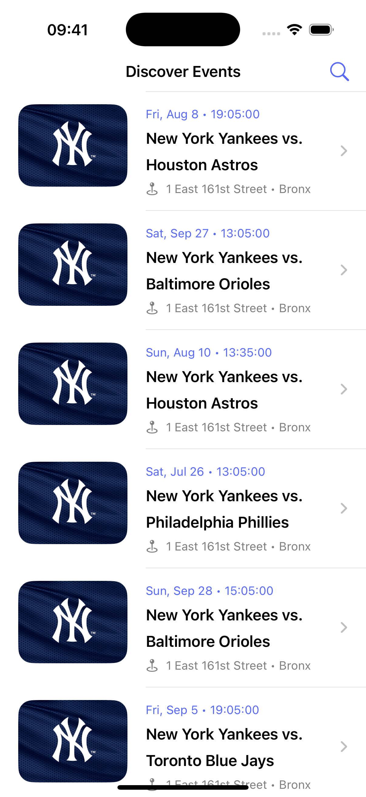
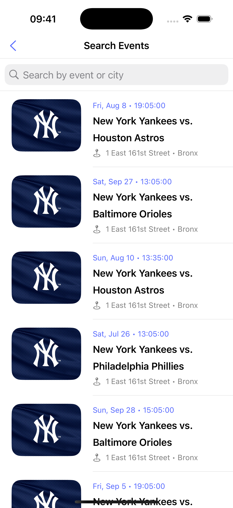

# Evently-EventsExplorer

Evently-EventsExplorer is an iOS application designed to help users discover and explore events. Built with modern Swift and SwiftUI, it showcases a clean architecture, robust networking, and a user-friendly interface for browsing event details.

## Screenshots






## Features

*   **Event Discovery:** Browse a list of events.
*   **Event Details:** View comprehensive information about each event.
*   **Search Functionality:** Easily find events using search queries.
*   **Clean Architecture:** Implemented with a clear separation of concerns using MVVM, Repositories, and Services.
*   **Asynchronous Operations:** Leverages Swift's `async/await` for efficient network requests.

## Setup

To run this project locally, you'll need to set up your API keys and base URLs.

1.  **Clone the repository:**
    ```bash
    git clone git@github.com:nanda-wk/Evently-EventsExplorer.git
    cd Evently-EventsExplorer
    ```

2.  **Create `Env.xcconfig`:**
    The project uses an `xcconfig` file to manage environment variables like API keys.
    Duplicate the `Env.xcconfig.example` file and rename it to `Env.xcconfig`.

    ```bash
    cp Evently-EventsExplorer/Resources/Env.xcconfig.example Evently-EventsExplorer/Resources/Env.xcconfig
    ```

3.  **Configure API Keys:**
    Open `Evently-EventsExplorer/Resources/Env.xcconfig` in your text editor and replace the placeholder values with your actual API key and base URL:

    ```
    // Evently-EventsExplorer/Resources/Env.xcconfig

    API_BASE_URL=https:/$()/app.ticketmaster.com         # This is the base URL for Ticketmaster Discovery API
    API_KEY=your_actual_api_key                          # Obtain your API key from the Ticketmaster Developer website: https://developer.ticketmaster.com/products-and-docs/apis/discovery-api/
    ```
    **Important:** Do not commit `Env.xcconfig` to your version control system as it contains sensitive information. It's already ignored by `.gitignore`.

4.  **Open in Xcode:**
    Open the `Evently-EventsExplorer.xcodeproj` file in Xcode.

    ```bash
    open Evently-EventsExplorer.xcodeproj
    ```

5.  **Build and Run:**
    Select a simulator or a physical device and run the project (`Cmd + R`).

## Running Tests

The project includes a comprehensive suite of unit tests.

To run the tests:

1.  Open the project in Xcode.
2.  Go to `Product` > `Test` (or press `Cmd + U`).

## Project Structure

```
Evently-EventsExplorer/
├───Evently-EventsExplorer/
│   ├───Components/           # Reusable UI components
│   ├───Core/                 # Main app entry point
│   ├───Data/                 # Data layer (Models, Network, Repositories, Services)
│   │   ├───Models/
│   │   ├───Network/
│   │   ├───Repositories/
│   │   └───Services/
│   ├───DI/                   # Dependency Injection setup
│   ├───Features/             # Feature-specific modules (EventDetail, Home, Search)
│   ├───Resources/            # Assets, configuration files
│   └───Utils/                # Utility extensions and helpers
├───Evently-EventsExplorerTests/    # Unit tests
└───Evently-EventsExplorer.xcodeproj/ # Xcode project file
```